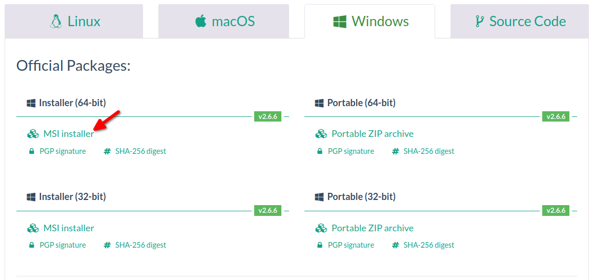

Le voyage en Cybérie approche.  

Afin de pouvoir réaliser les activités le jour J, il est recommandé de télécharger quelques fichiers. Cela vous évitera de vous connecter au Wi-Fi de la médiathèque (qui est faible là où le voyage aura lieu) ou en partage de connexion avec votre téléphone.  

* Téléchargez KeePassXC pour votre ordinateur : [https://keepassxc.org/download/](https://keepassxc.org/download/) 
  - Pour Windows, l’installateur MSI fera parfaitement l’affaire, et vous avez de grandes chances d’avoir un processeur 64 bits :
 
  - Pour macOS, choisissez l’application qui correspond à votre processeur. En cas de doute, téléchargez les deux et nous verrons ensemble le jour J.
  - Pour Linux, vous trouverez probablement KeePassXC dans votre logithèque. Si c’est le cas, assurez-vous d’avoir au moins la version 2.6. Sinon, téléchargez l’AppImage sur le site de KeePassXC.
          
* Installez KeePassXC sur votre ordinateur (en gardant les réglages proposés par défaut – nous repasserons à travers le jour du voyage)
          
* Installez l’extension KeePassXC-Browser sur votre navigateur web favori :
  - Pour Firefox ou Tor, visitez [https://addons.mozilla.org/en-US/firefox/addon/keepassxc-browser](https://addons.mozilla.org/en-US/firefox/addon/keepassxc-browser)
  - Pour Google Chrome, Chromium, Vivaldi et Brave, visitez [https://chrome.google.com/webstore/detail/keepassxc-browser/oboonakemofpalcgghocfoadofidjkkk](https://chrome.google.com/webstore/detail/keepassxc-browser/oboonakemofpalcgghocfoadofidjkkk)
  - Pour Microsoft Edge, visitez [https://microsoftedge.microsoft.com/addons/detail/keepassxcbrowser/pdffhmdngciaglkoonimfcmckehcpafo](https://microsoftedge.microsoft.com/addons/detail/keepassxcbrowser/pdffhmdngciaglkoonimfcmckehcpafo)

* Téléchargez le formulaire HTML de test : [https://github.com/ftassy/Voyages-en-Cyberie/module_mots_de_passe/formulaire.html](https://github.com/ftassy/Voyages-en-Cyberie/module_mots_de_passe/formulaire.html)